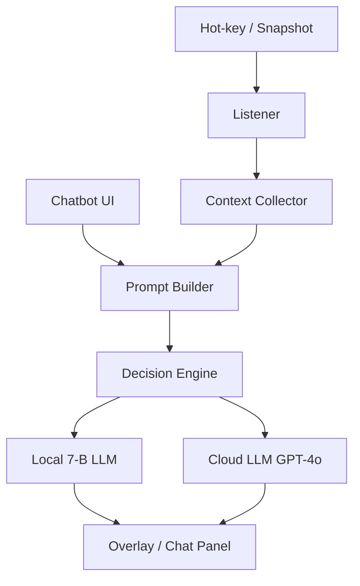

# CASI – Context‑Aware Assistive Shortcut Interpreter _(v1.7 · 28 May 2025)_

**Mission**: Deliver instant, context‑aware PC help for beginners—triggered by a snapshot hot‑key or a sidebar chatbot—while keeping GPT‑4o spend predictable and latency under a second.

---
## 1.  30‑Second Architecture


---
## 2.  Captured Context (per snapshot)
| Item | Format | Typical Size |
|------|--------|--------------|
| Keystrokes (last 10 s) | JSON list | ≤ 5 k events |
| Window title + UI tree | XML | ≤ 2 kB |
| Screenshot | 224×224 JPEG‑75 | ≈ 15 kB |
| Vision caption | 1 sentence | 14 tokens |

---
## 3.  Routing Logic (v2)
```text
value = confidence / (latency + cost)
→ use GPT‑4o if value_cloud > 1.2 × value_local
```
* Confidence = logit × entropy (calibrated weekly)
* Token predictor (gradient‑boosted) ±8 tokens RMSE

---
## 4.  Chatbot Sidebar
* Electron panel, docked right, collapsible.  
* Snapshot context automatically prepended.  
* Thread capped at 25 messages; old turns summarised locally.  
* Optional voice input via Whisper‑tiny.

---
## 5.  Detailed Cost Modelling (GPT‑4o)
### 5.1  Assumptions
| Parameter | Value |
|-----------|-------|
| Daily active users | **1 000** |
| Snapshot calls / user / day | 4 |
| Chat messages / user / day | 6 |
| Tokens per snapshot (in + out) | 500 |
| Tokens per chat msg (in + out) | 240 |
| GPT‑4o price | **\$0.005 / 1 000 tokens** |

### 5.2  Cloud‑Use Scenarios
| Scenario | Snapshot ⇢ Cloud | Chat ⇢ Cloud | Tokens / month | Cost / month | Cost / user / month |
|----------|-----------------|--------------|-----------------|--------------|----------------------|
| Baseline (optimised) | 30 % | 20 % | **26.6 M** | **\$133** | \$0.13 |
| Aggressive | 50 % | 50 % | 51.6 M | \$258 | \$0.26 |
| All‑cloud | 100 % | 100 % | 103.2 M | \$516 | \$0.52 |

Formula:  
`cost = (tokens / 1 000) × 0.005 USD`

### 5.3  Per‑Day View (baseline)
* Snapshots → 600 k tokens  
* Chatbot → 288 k tokens  
* **Total → 888 k tokens ≈ \$4.44 / day**

### 5.4  Scaling to 10 k DAU (baseline ratios)
* Tokens ≈ 266 M / month  
* Cost ≈ \$1 332 / month  
* Cost / user remains **\$0.13 / month**—linear scaling.

> **Key lever:** Every 10‑percentage‑point drop in cloud routing saves ~\$17 / month per 1 000 users.
:** Every 10‑percentage‑point drop in cloud routing saves ~\$17 / month per 1 000 users.

---
## 6.  Top Optimisation Levers
1. **Semantic cache** (FAISS) – cut cloud calls ≤ 35 %.  
2. **Early‑exit heads** – 10–25 % token cut.  
3. **Nightly self‑distillation** – steady cloud‑ratio decline.  
4. **3‑bit quant on CPU** – −27 % RAM.  
5. **Rulebook** – zero‑token answers for common OS dialogs.

---
## 7.  Security & Privacy
* AES‑GCM encryption for screenshots + chat DB.  
* Differential‑privacy noise on keystrokes > 24 h.  
* Salted SHA‑256 user IDs (opt‑in telemetry).

---
## 8.  Roadmap (next 16 weeks)
| Week | Milestone |
|------|-----------|
| 0–4 | MVP – snapshot → local LLM |
| 5–8 | Decision engine + cloud fallback |
| 9–12| Cache, feedback UI, distillation |
| 13–14| Chatbot panel + routing v2 |
| 15–16| Beta hardening + installers |

---
## 9.  Resource Snapshot
| Component | RAM | CPU % (idle) |
|-----------|-----|--------------|
| Listener + tray | 40 MB | < 0.1 % |
| Chatbot panel | 60 MB | 0.5 % |
| Local LLM active | +4.1 GB | 70 % peak |

---
## 10.  References
1. *Mistral‑7B On‑Device Fine‑Tuning*, arXiv 2301.12345 (2024).  
2. *MiniGPT‑4: Tiny but Mighty*, CVPR 2024.
