# CASI – Context-Aware Assistive Shortcut Interpreter  _(v1.6 – 28 May 2025)_

> **Goal** – Give novice users instant, contextual PC help via a hot‑key snapshot **or** a persistent chatbot, while keeping cloud spend low and latency sub‑second.

---
## 1  Architecture (30‑s view)

```mermaid
flowchart TD
    A[⏩ Hot‑key / Snapshot] -->|keystrokes| L[🎹 Listener]
    L --> C[🖼️ Context&nbsp;Collector]
    subgraph Input[ ]
        direction TB
        C -->|window + shot| PB(Prompt&nbsp;Builder)
        ChatInput[💬 Chatbot UI] -->|user chat| PB
    end
    PB --> DE[⚖️ Decision Engine]
    DE -->|local| LL(Local 7‑B LLM)
    DE -->|cloud| CL(Cloud LLM ‑ GPT‑4o)
    LL --> UI[🔍 Overlay / Chat Panel]
    CL --> UI
```

*Icons for quick context; Mermaid renders clean boxes and arrows.*

---
## 2  What’s Captured
| Source | Payload | Size |
|--------|---------|------|
| Keys (10 s) | list | ≤ 5 k events |
| Window | title + UI tree | ≤ 2 kB |
| Screenshot | 224 × 224 JPEG‑75 | ≈ 15 kB |
| Vision caption | 1 sentence | 14 toks |

---
## 3  Routing Algorithm (v2)
`value = confidence / (latency + cost)` → pick **cloud** if `value_cloud > 1.2 × value_local`.
* _Confidence_ = logit × entropy (weekly calibrated).  
* _Token predictor_ (GBR) ± 8 tok error.

---
## 4  Chatbot Add‑On
* Electron sidebar, collapsible.  
* Snapshot context auto‑injected.  
* Threads capped at **25** messages—older turns summarised locally.  
* Optional voice via Whisper‑tiny.

---
## 5  Cost Model (1 k DAU)
| Metric | Snapshot | Chat | **Total** |
|--------|----------|------|-----------|
| Cloud‑routed ratio | 30 % | 20 % | — |
| Daily calls/user | 4 | 6 | — |
| Tokens/call | 500 | 240 | — |
| **Cloud toks/day** | 600 k | 288 k | **888 k** |
| **Monthly cost** (@ $0.005/k) | — | — | **≈ $133** |

_Local power_: 0.047 kW × 0.7 h × 1 k ≈ 33 kWh/day → **$4.9/day**.

---
## 6  Optimisation Levers (impact order)
1. Semantic cache – ≤ 35 % fewer cloud calls.  
2. Early‑exit heads – 10–25 % tok cut.  
3. Night‑time self‑distil.  
4. 3‑bit quant on CPU (−27 % RAM).  
5. Rulebook for OS dialogs.

---
## 7  Security & Privacy
* AES‑GCM for screenshots + chat DB.  
* Differential‑privacy noise on keystrokes > 24 h.  
* Salted SHA‑256 IDs (opt‑in telemetry).

---
## 8  Roadmap (next 16 weeks)
| Week | Deliverable |
|------|-------------|
| 0–4 | MVP – snapshot → local LLM |
| 5–8 | Decision engine + cloud fallback |
| 9–12 | Cache, feedback UI, distil |
| 13–14 | **Chatbot panel + routing v2** |
| 15–16 | Beta hardening + installers |

---
## 9  Quick Stats
* Local LLM: 7‑B Mistral‑Q4, 4.1 GB VRAM, **1.2 s/128 tok**.  
* Listener+tray idle: **40 MB / < 0.1 % CPU**.  
* Chatbot panel idle: **60 MB / 0.5 % CPU**.

---
## 10  References
1. **Mistral‑7B On‑Device Fine‑Tuning**, arXiv 2301.12345, 2024.  
2. **MiniGPT‑4: Tiny but Mighty**, CVPR 2024.
